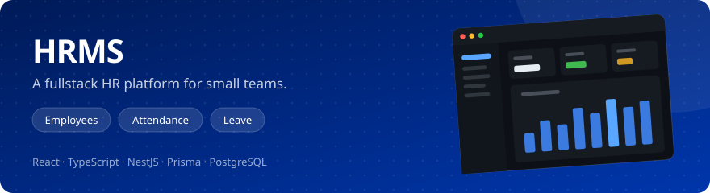

<picture>
  <source media="(prefers-color-scheme: dark)" srcset="./assets/header-dark.gif">
  
</picture>

Fullstack engineer who builds business apps people use every day. Next.js, NestJS, and PostgreSQL.

   

## What I do

💼 &nbsp;Built the frontend for 3 business systems at Techindika, including a multi-tenant HRMS and a college ERP 
🤖 &nbsp;Built the [frontend] for an AI agent platform that turns docs and APIs into an embeddable chat widget 
🧩 &nbsp;Build the hard parts of admin apps: role-based access, approval flows, and data-heavy tables 
🐳 &nbsp;Self-host my apps on a Linux VPS with Nginx, Docker, and HTTPS 
📬 &nbsp;Open to freelance projects. Say hi at [hello@akinurrahman.com](mailto:hello@akinurrahman.com)

## Featured projects

<!-- WALKTHROUGH CLIP. GitHub strips <video> and <iframe>, so player markup cannot be
hand-written here. The only way to get a real inline player is GitHub's own upload:
drag the .mp4 into a new issue comment (the upload fires on drop, no need to submit),
copy the github.com/user-attachments/assets/... URL it returns, and paste that URL
bare on its own line right here. Cap is 10MB on the free plan.

  ffmpeg -i raw.mp4 -vf "scale=1280:-2,fps=30" -c:v libx264 -crf 30 -preset slow -an -movflags +faststart demo.mp4

Fallback if the clip will not fit: a linked YouTube thumbnail. Not a player, just a
clickable image, and hqdefault if maxresdefault 404s on a fresh upload.

-->

## Tech stack

<picture>
  <!-- Commas are percent-encoded: a bare comma in srcset splits the URL into image candidates. -->
  <source media="(min-width: 768px)" srcset="https://skillicons.dev/icons?i=ts%2Cjs%2Creact%2Cnextjs%2Cnodejs%2Cnestjs%2Cexpress%2Cpostgres%2Cprisma%2Cmongodb%2Cdocker%2Cnginx%2Ctailwind%2Clinux%2Cgit&perline=15">
  
</picture>

## GitHub activity

<picture>
  <source media="(prefers-color-scheme: dark) and (min-width: 768px)" srcset="./assets/stats-dark-wide.svg">
  <source media="(min-width: 768px)" srcset="./assets/stats-light-wide.svg">
  <source media="(prefers-color-scheme: dark)" srcset="./assets/stats-dark.svg">
  
</picture>
