<picture>
  <source media="(prefers-color-scheme: dark)" srcset="./assets/header-dark.gif">
  
</picture>

Fullstack Engineer building ERP and business apps end to end.
Next.js on the front, NestJS and PostgreSQL on the back, deployed on my own VPS.

   

## What I do

💼 &nbsp;Built the frontend for 3 business systems at Techindika, including a multi-tenant HRMS and a college ERP

🤖 &nbsp;Built the [frontend] for an AI agent platform that turns docs and APIs into an embeddable chat widget

🧩 &nbsp;Build the hard parts of admin apps: role-based access, approval flows, and data-heavy tables

🐳 &nbsp;Self-host my apps on a Linux VPS with Nginx, Docker, and HTTPS

📬 &nbsp;Open to freelance projects. Say hi at [hello@akinurrahman.com](mailto:hello@akinurrahman.com)

## Tech stack

<picture>
  <source media="(min-width: 768px)" srcset="https://skillicons.dev/icons?i=ts,js,react,nextjs,nodejs,nestjs,express,postgres,prisma,mongodb,docker,nginx,tailwind,linux,git&perline=15">
  
</picture>

## GitHub activity

<picture>
  <source media="(prefers-color-scheme: dark) and (min-width: 768px)" srcset="./assets/stats-dark-wide.svg">
  <source media="(min-width: 768px)" srcset="./assets/stats-light-wide.svg">
  <source media="(prefers-color-scheme: dark)" srcset="./assets/stats-dark.svg">
  
</picture>
